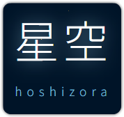

<p align="center">
 
 <h2 align="center">星空 <i>(hoshizora)</i></h2>
</p>


- [The Blog](https://notes.markterence.me/66116/hoshizora-one-of-my-quick-weekend-project)

<h2></h2>

<p align="center">

</p>


## Demo

<p>Show usernames:</p>


<p>Hide usernames:</p>
 

<p>Empty, when no stargazers yet: (default message is "A quiet night sky" and cannot be changed)</p>
 

**Example snippet:**

```html

 
 
```

## Live

```
https://hoshizora.markterence.me/github-stargazers/:github-username/:repo?show=show_usernames=1
```

Currently, the live version only accept my repositories(`markterence`) as I haven't set up a caching configuration and it's not production ready. This is also a precaution to avoid hitting GitHub API rate limits. You can open an issue to request adding your GitHub user/org handle to the allowed list (it must be your own not someone else's or your Github org you manage).


## Development

To install dependencies:
```sh
pnpm install
```

To run in development
```sh
pnpm run dev
```

**Setup Environment Variables:**

Create a `.env` file in your project root with the following variables:

```bash
GITHUB_API_TOKEN=github_pat_your_token_here
ALLOWED_GITHUB_OWNERS=user1,user2,organization1
```

- `GITHUB_API_TOKEN`:  GitHub Personal Access Token with repo read permissions. (Create token in [GitHub Settings > Developer settings](https://github.com/settings/personal-access-tokens)
- `ALLOWED_GITHUB_OWNERS`: Comma-separated list of GitHub usernames allowed to use the service. Example: `markterence,myfriend1`

## Endpoints

### Stargazer SVG Card

```txt
GET /github-stargazers/:owner/:repo
```

**Query Params**

| Query | Description | Value
| --- | --- | --- |
| `show_usernames` | Should it show the first three user who starred the repo. | Example Value: `true`, `1` |

## LICENSE

- Website code, design, and content are licensed under [CC BY 4.0](LICENSE-CCBY).
  - **TL;DR:** You are free to use, share, and adapt as long as you give appropriate credit.
- All backend source code files (backend logic if present) are licensed under the [MIT License](LICENSE).

See the individual license files for full terms.
